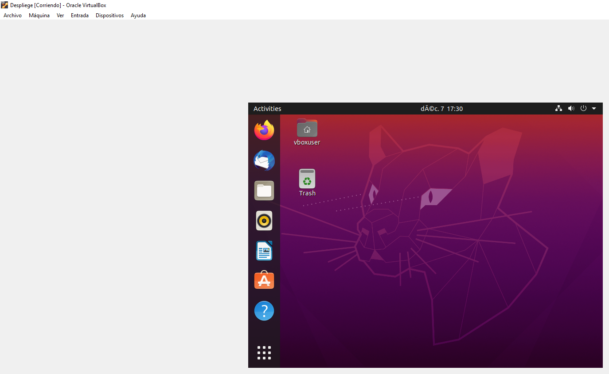

--1 Proyecto Despliegue Samuel Pichardo Perez 

Para la primera parte de este proyecto estare alojando una maquina virtual con VirtualBox usando la imagen iso de Ubuntu (Ubuntu 20.04) donde configurare y administrare todos los apartados que se piden en el proyecto y los ire comentando en este archivo dentro del github.

Para comenzar el proyecto debemos descargar e instalar Virtualbox o acceder a alguna maquina con ubuntu para poder realizar las instalaciones y configuraciones necesarias, como es mi caso y ya comente descargare VirtualBox e iniciare una maquina virtual con Ubuntu.
 
