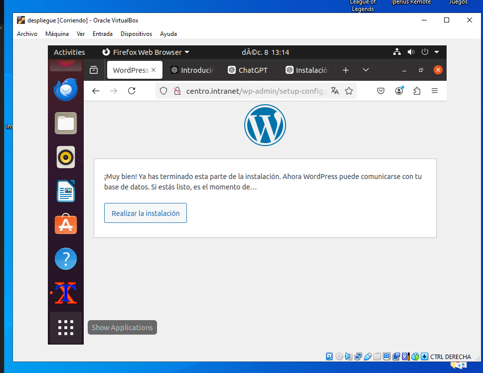
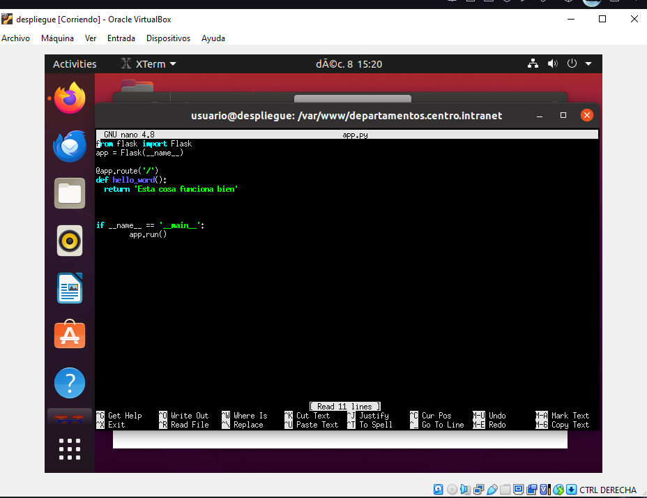
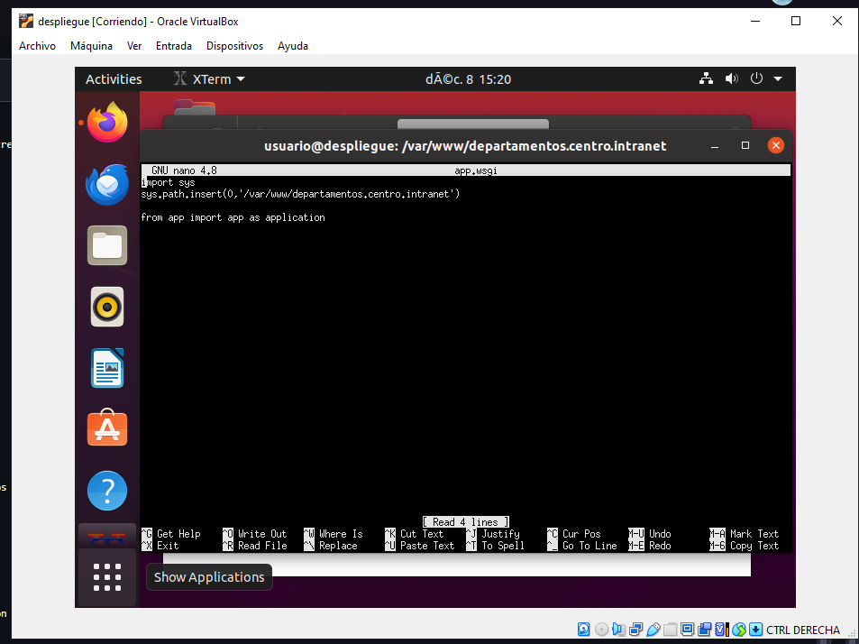
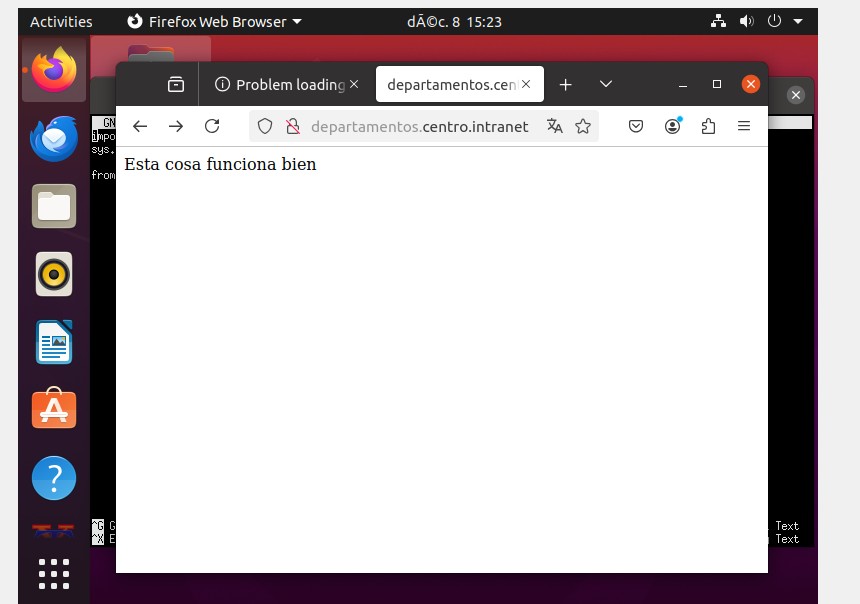
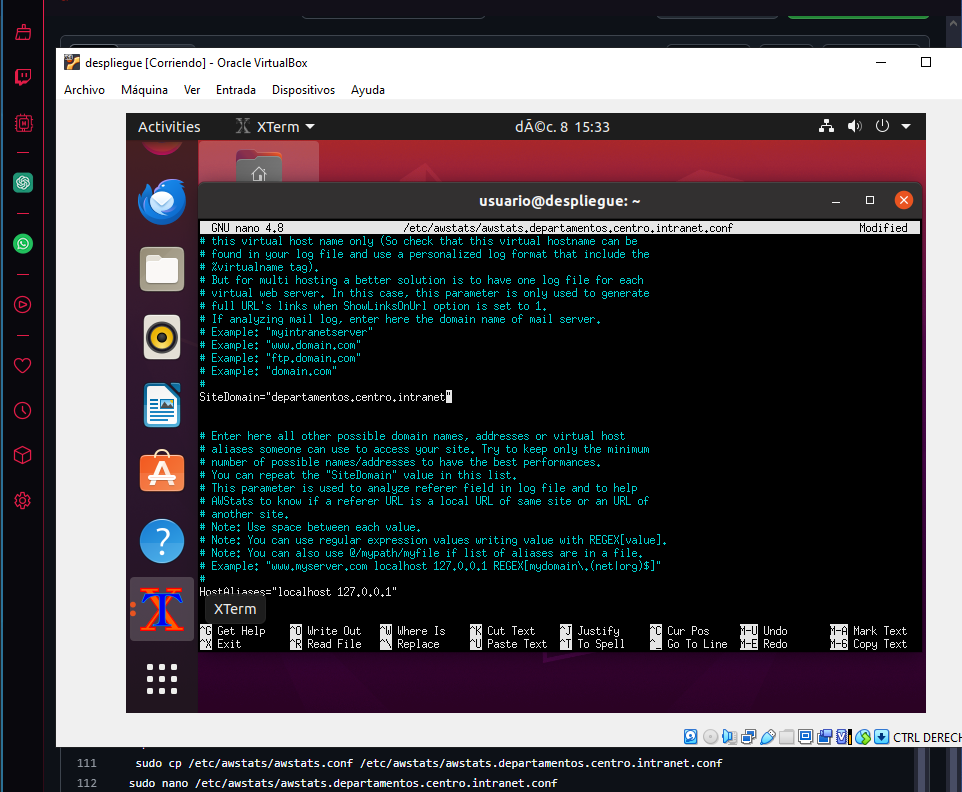
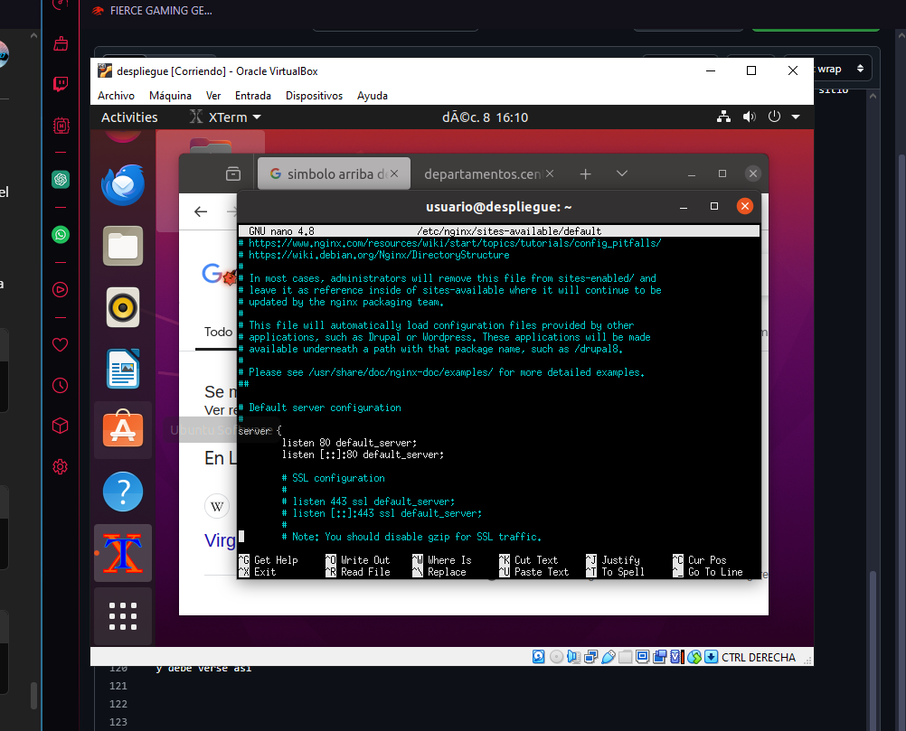
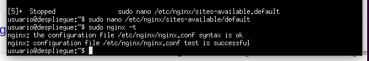
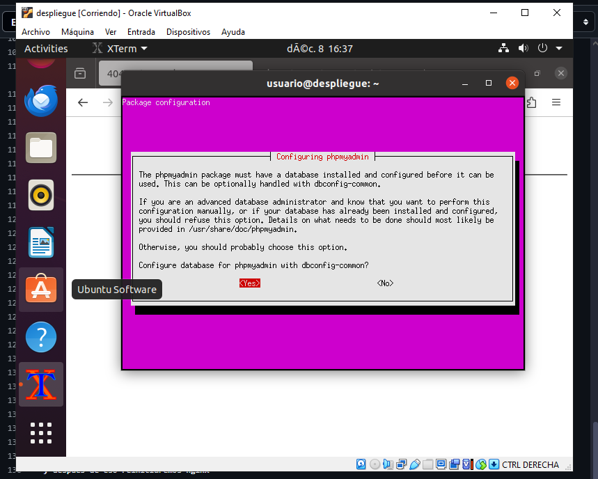

--1 Proyecto Despliegue Samuel Pichardo Perez 

Para la primera parte de este proyecto estare alojando una maquina virtual con VirtualBox usando la imagen iso de Ubuntu (Ubuntu 20.04) donde configurare y administrare todos los apartados que se piden en el proyecto y los ire comentando en este archivo dentro del github.

Para comenzar el proyecto debemos descargar e instalar Virtualbox o acceder a alguna maquina con ubuntu para poder realizar las instalaciones y configuraciones necesarias, como es mi caso y ya comente descargare VirtualBox e iniciare una maquina virtual con Ubuntu.
 

Una vez tenemos nuestra maquina virutal operativa debemos seguir una serie de tareas para poder llevar acabo el proyecto, una de las primeras que debemos abordar seria la instalacion de todo lo necesario como podria ser apache, SQL, PHP entre otros.
-Preparativos iniciales
Como primer paso del Proyecto realizaremos los siguientes comandos en la consola 
sudo apt update && sudo apt upgrade -y
Para actualizar nuestros datos y despues de eso accederesos a el archivo /etc/hosts para modificar las entradas añadiendo las direcciones que se podiden en el ejercicio

-Instalacion de Apache.
Para continuar con la instalacion de Servidor Web Apache lo primero que debemos realizar es una instalacion simple con 

sudo apt install apache2 

y a continuacion activar los modulore requeridos 

sudo a2enmod php7.4 (para esto debemos tener php ya instalado) -----
sudo a2enmod rewrite
sudo systemctl restart apache2 (para reiniciar nuestro apache) 

-Instalacion de Php y MySql
Para seguir con la instalacion de php y MySql debemos insertar el siguiente comando en la consola.

sudo apt install php libapache2-mod-php php-mysql mysql-server -y

si todo sale bien deberiamos esperar un poco y todo quedara listo.
Una vez instalado apache php y my SQL vamos a continuar creando una base de datos para WordPress

  Comenzamos una configuracion segura con 
  sudo mysql_secure_installation
   Y creamos una base de datos para WordPrees  
       sudo mysql -u root -p

     CREATE DATABASE wordpress_db;
      
      

Para ello lo primero que debemos hacer es intalar e instalar Wordpress con los siguientes comandos.

wget https://wordpress.org/latest.tar.gz
tar -xvzf latest.tar.gz
sudo mv wordpress /var/www/centro.intranet (aqui mandamos los datos a la dirrecion que debe tenerla como se pide en el proyecto)

Y configuramos los permisos

sudo chown -R www-data:www-data /var/www/centro.intranet
sudo chmod -R 755 /var/www/centro.intranet 

Y despues de esto debemos configurar apache para WordPress y para esto debemos crear un archvio de configuracion el la ruta /etc/apache2/sites-available/centro.intranet.conf con lo siguiente

<VirtualHost *:80>
    ServerName centro.intranet
    DocumentRoot /var/www/centro.intranet
    <Directory /var/www/centro.intranet>
        AllowOverride All
    </Directory>
</VirtualHost>
Debe quedar Algo como esto. 
 
e Habilitamos el sitio 

sudo a2ensite centro.intranet
sudo systemctl restart apache2

y como podemos comprobar funciona 
 
Ahora debemos realizar la configuracion de wordpress y para ello debemos rellenar los campos con la base de datos creada anteriormente y como usuario y contraseña usaremos root para que tenga acceso directo y no debamos modificar los persmisos.
 

--Instalacion de Python 
sudo apt install python3 python3-pip libapache2-mod-wsgi-py3
pip3 install flask

debemos crear nuestros archivos dentro del dirrectorio  /var/www/departamentos.centro.intranet
que seran los siguientes 
 
 
y una vez los archivos se hayan creado debemos modificar la configuracion del sitio
sudo nano /etc/apache2/sites-available/departamentos.centro.intranet.conf 
y debe quedar una cosa como esta 
<VirtualHost *:80>
    ServerAdmin webmaster@departamentos.centro.intranet
    ServerName departamentos.centro.intranet
    DocumentRoot /var/www/departamentos.centro.intranet
    WSGIScriptAlias / /var/www/departamentos.centro.intranet/app.wsgi
    <Directory /var/www/departamentos.centro.intranet>
        Require all granted
    </Directory>
  
</VirtualHost>
una vez el archivo de configuracion se haya modificado debemos reinciar apache2 y activar el sitio web 
sudo a2ensite departamentos.centro.intranet
sudo systemctl restart apache2

 
Como podemos comprobar funciona.
--Instalar AWSTATS
sudo apt install awstats
Para configurarlo dentro de nuestro sitio web debemos copiar el archivo de configuracion predeterminado de awstats en el directorio de nuestro sitio web 
sudo cp /etc/awstats/awstats.conf /etc/awstats/awstats.centro.intranet.conf
una vez ahi modificamos el archivo para que mire a nuestro dominio
sudo nano /etc/awstats/awstats.centro.intranet.conf
 

--Instalar Nginx 
sudo apt install nginx php-fpm -y

configuramos Ngix modificando el archivo por defecto de ngin sudo nano /etc/nginx/sites-available/default y modifcamos el codigo para que escuche al puerto 8080 y pueda utilizar php 
 
con el comando sudo nginx -t podemos comprobar la sintaxis del archivo de configuracion 
 
como vemos ningun problema 
--Instalar php my admin. 
sudo apt install phpmyadmin -y
sudo ln -s /usr/share/phpmyadmin /var/www/html/phpmyadmin
con este ultimo comando hacemos la instalacion de phpmyadmin en apache se comparta con nginx y no tengamos problemas de compatibilidad.

Una vez todo queda bien configurado ya podriamso acceder a nuestro phpmyadmin desde nginx 
